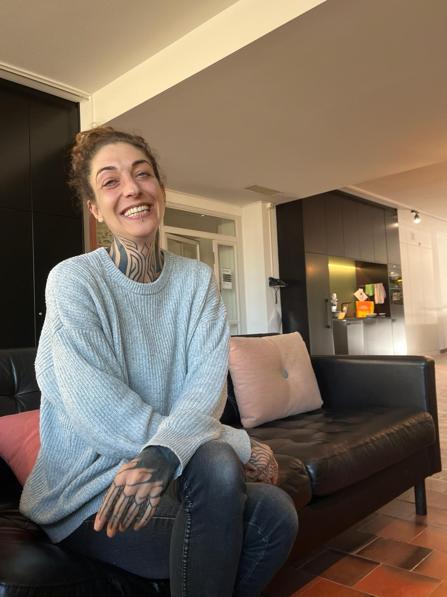

+++
title = "Hinter den Kulissen – Der Beruf einer Eventtechnikerin im Naturhistorischen Museum Bern"
date = "2024-02-26"
draft = false
pinned = false
image = "denise-mast.jpg"
description = "Das Naturhistorische Museum in Bern ist das älteste Museum der Stadt. Es ist ein besonderes Museum, welches sich durch vielfältige und spannende Ausstellungen zu vielfältigen Themen auszeichnet Doch nur dank der vielen Menschen, die im Museum dafür sorgen, dass es existieren kann, wie es ist, vermittelt es einen so einzigartigen Charakter. Aber wer sind diese Menschen überhaupt und was sind nun wirklich ihre Aufgaben?"
+++

Das Naturhistorische Museum in Bern ist das älteste Museum der Stadt. Es ist ein besonderes Museum, welches sich durch vielfältige und spannende Ausstellungen zu vielfältigen Themen auszeichnet Doch nur dank der vielen Menschen, die im Museum dafür sorgen, dass es existieren kann, wie es ist, vermittelt es einen so einzigartigen Charakter. Aber wer sind diese Menschen überhaupt und was sind nun wirklich ihre Aufgaben?


Eliah Siegwart, Naomi Pauli

Eingangshalle des Naturhistorischen Museums Bern. Mehrere Kinder sind zu hören, sie warten gespannt darauf, endlich die Ausstellungen zu sehen. Wir treffen unsere Interviewpartnerin Denise Mast und werden in einen Pausenraum geführt. Hier riecht es nach Kaffee, der Raum versprüht eine gemütliche Atmosphäre. Es sind ihre Arbeitskolleg*innen, die hier gerade ihre Mittagspause verbringen. Wir werden zu einem Sofa geführt, wo wir uns setzen.

#### Wie sind Sie dazu gekommen, als Eventtechnikerin im Naturhistorischen Museum zu arbeiten?

Nachdem ich bereits etliche Jahre Berufserfahrung in verschiedenen Bereichen hatte, habe ich begonnen, bei grösseren Events mit der „Röck’n’Röll-Krew“ zu arbeiten. Darauf folgte eine Anstellung im Zürcher Opernhaus, gefolgt von einer Stelle in einer Firma für Veranstaltungstechnik in Bern. Dort half ich im Lager und bei verschiedenen Veranstaltungsprojekten. Später landete ich erneut in Zürich, dieses Mal im Schauspielhaus, wo ich fünfeinhalb Jahre blieb. Schlussendlich kam ich hier hin, ins Naturhistorische Museum Bern. In den Jahren davor habe ich realisiert, dass ich lieber mehr berufliche Freiheiten und Zeit hätte. Ein Kollege hat mir das Stelleninserat meiner jetzigen Stelle zukommen lassen. Es hörte sich sehr spannend an, obwohl ich keine handwerkliche Ausbildung habe, rief ich an, wurde zum Vorstellungsgespräch eingeladen und bekam die Stelle. Nun bin ich seit ungefähr vier Jahren hier.

>  „In den Jahren davor habe ich realisiert, dass ich lieber mehr berufliche Freiheiten und Zeit hätte.“ (Denise Mast)


Denise Mast
Auch wenn Denise nun schon länger in ihrer Branche arbeitet, war das nicht immer so. Nach der Schule wollte sie ursprünglich ans Gymnasium, allerdings hat sie dann doch eine Lehre als Kauffrau gemacht. Nach der Lehre verbrachte sie zweieinhalb Monate im Ausland; während dieser Zeit wurde ihr bewusst, dass sie etwas anderes machen will. Durch intensive Gespräche mit einer Kollegin, welche im Dachstock der Reitschule Bern arbeitete, fand sie heraus, was sie interessierte. So landete sie anschliessend bei der „Röck’n’Röll-Krew“ in Köniz.


#### Was sind Ihre Aufgaben hier?

Zu meinen Hauptaufgaben gehört die Eventtechnik bei internen, kleineren Events, bei welchen ich für alles Technische, wie Ton, Licht und Video, zuständig bin. Bei der Ausstellungstechnik bin ich für die Multimedia zuständig, d.h. bei Ausstellungen, die schon bestehen, schaue ich regelmässig, ob alle Geräte und Installationen funktionieren. Bei Bedarf bekomme ich externe Unterstützung. Der Aufbau von Ausstellungen gehört ebenfalls zu meinen Aufgaben. Zudem bin ich verantwortlich für das unser grosses Lager mit all unserem Material.

#### Was schätzen Sie besonders an Ihrer Arbeit?

Die Vielfältigkeit. Meine Arbeit empfinde ich als spannend und ich schätze es sehr, dass ich so viel Neues lerne. Ich kam von der Lichttechnik und beschäftige mich jetzt mit Multimedia. Bei keiner Ausstellung, die wir realisieren, gibt es vorgefertigte Lösungen, wir müssen jeweils eigene entwickeln. Die Zusammenarbeit, die es dafür braucht, macht mir Spass. Ich habe hier im Naturhistorischen Museum sehr viel Freiheit und werde unterstützt, auch wenn ich selbst ein Projekt starten will, wie z.B. etwas zu erneuern. Wenn ich Ideen habe, kann ich diese einbringen und meistens werden sie gutgeheissen. 

> „Ich habe hier im Naturhistorischen Museum sehr viel Freiheit und werde unterstützt, auch wenn ich selbst ein Projekt starten will, wie z.B. etwas zu erneuern.“ (Denise Mast)

#### Woran arbeiten Sie momentan? 

Gewisse Sachen müssen an der momentanen Sonderausstellung optimiert werden, da helfe ich mit. Es gibt ausserdem eine neue, kleine Ausstellung, welche bald eröffnet wird. Der Bau läuft bereits, ich bin für das Licht zuständig. Bei Ausstellungen, welche schon länger stehen, wie z.B. „Barry“, muss ich gewisse Dinge reparieren, die nicht mehr funktionieren oder ersetzen, da es keine entsprechenden Ersatzteile mehr gibt.

#### Wie sieht der Ablauf von der Entstehung einer Ausstellung bis zur Eröffnung aus?

Es ist so, dass die Planungsphase viel länger dauert als die Umsetzung. In der ersten Phase spielen die Kuratoren und die Projektleitung eine grosse Rolle. Je nach Ausstellungsprojekt arbeiten wir mit externen Szenographen zusammen, welche die Ideen und Vorstellungen des Projektteams umsetzen. Im ganzen Ablauf wird bereits relativ früh besprochen, wie etwas umgesetzt werden könnte. Der Ideenfindungsprozess dauert sehr lange, danach geht zuerst um die Kosten, bevor schlussendlich der Startschuss zum Bau fällt und wir mit unserer Arbeit beginnen können. 

#### Man hat das Gefühl, das man die Person hinter Ihrer Arbeit gar nicht sieht. Wünschten Sie sich manchmal, dass die Leute wüssten, wer hinter dieser Arbeit steckt?

Nein, aber so bin vielleicht einfach ich von meinem Charakter her. Mir ist viel wichtiger, dass die Zusammenarbeit im Team gut funktioniert hat. Wenn ich meinen beruflichen Werdegang anschaue, war ich immer hinter den Kulissen, weil ich die das Rampenlicht nicht brauche und auch nicht mag. Abgesehen davon ist es in meiner Rolle schon so, dass ich Wertschätzung bekomme und gesehen wird, was ich mache.

#### Wie denken Sie, wird sich das Naturhistorische Museum in der Zukunft verändern? 

Ich denke, es wird Veränderungen geben, wenn man z.B. schaut, wie die Ausstellungen jetzt sind, im Gegensatz zu früher. Es ist alles viel interaktiver, technischer, wie auch baulich viel anspruchsvoller geworden. Ein zunehmend wichtiger Aspekt ist die Nachhaltigkeit, darauf legen wir sehr grossen Wert. Die Nachhaltigkeit bringt Veränderungen mit sich an die wir uns anpassen müssen. Wir können nicht mehr alles so machen wie früher, wir müssen neue Wege finden. Es wird sich ausserdem intern viel ändern, da wir haben viel Mitarbeitende haben, die seit 20, 30 Jahren hier sind. Es werden in nächster Zeit relativ viele Leute pensioniert, das bedeutet, dass viele neue Mitarbeitende zu uns stossen und neue Perspektiven einbringen werden.

> „. Ein zunehmend wichtiger Aspekt ist die Nachhaltigkeit, darauf legen wir sehr grossen Wert.“ (Denise Mast)