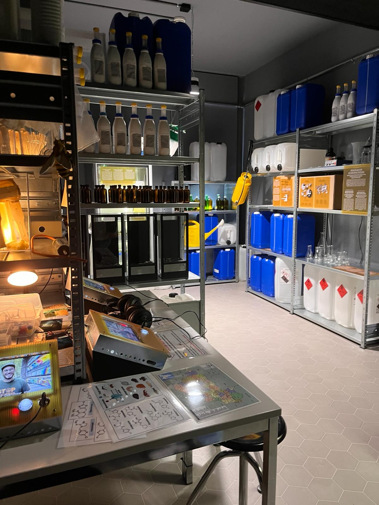

+++
title = "Hinter den Kulissen - Die unsichtbaren Helden des Naturhistorischen Museums Bern "
date = "2024-02-21"
draft = false
pinned = false
image = "museum.jpg"
description = "Wir alle waren schon einmal in einem Museum und haben Ausstellungen besucht, ohne zu wissen, wie viel Arbeit hinter so einer Ausstellung wirklich steckt. Das Naturhistorische Museum in Bern ist kein gewöhnliches Museum, denn wenn man durch die Ausstellungen läuft, kann man selbst aktiv werden. Die Informationen und Botschaften, die vermittelt werden, sind in passend gestaltete Räume integriert und überall befinden sich interaktive Posten. Wer sind denn aber nun die Helden hinter dem Ganzen?"
+++


Wir alle waren schon einmal in einem Museum und haben Ausstellungen besucht, ohne zu wissen, wie viel Arbeit hinter so einer Ausstellung wirklich steckt. Das Naturhistorische Museum in Bern ist kein gewöhnliches Museum, denn wenn man durch die Ausstellungen läuft, kann man selbst aktiv werden. Die Informationen und Botschaften, die vermittelt werden, sind in passend gestaltete Räume integriert und überall befinden sich interaktive Posten. Wer sind denn aber nun die Helden hinter dem Ganzen?



Eliah Siegwart, Naomi Pauli

Hinter Blättern versteck sieht man ein beiges Gebäude, es ist das berühmte Naturhistorische Museum in Bern. Im Gebäude befinden sich umherwirbelnde Schüler und im Eingangsbereich riecht es nach Essen. Die Eltern helfen den Kindern in der Garderobe direkt am Eingang, die Jacken auszuziehen. Denise Mast taucht auf, sie ist eine dieser Heldinnen, sie läuft die Betontreppe, welche man vom Eingang zentral sieht, hinunter. Sie trägt einen grauen Pullover und eine schwarze Hose, ihre braunen Haare sind nach hinten gebunden, ihre Haut ist mit Tattoos geschmückt. Ganz oben ist der Pausenraum der Mitarbeitenden. Es riecht nach Kaffee, an verschiedenen Tischen sitzen plaudernde Menschen, die vermutlich gerade Mittagspause machen. Denise Mast arbeitet hier nun schon seit ein paar Jahren, vorher hat sie alles Mögliche ausprobiert und viel Erfahrung in verschiedenen Berufen gesammelt. Im Naturhistorischen Museum arbeitet sie als Eventtechnikerin, ihre Aufgaben sind vielfältig und keinesfalls uninteressant. Man fragt sich schon fast, was sie denn eigentlich nicht macht. Auch sie leistet einen grossen Beitrag dazu, dass im Museum alles so gut funktioniert.  

#### Das Naturhistorische Museum Bern

Das Museum übertrifft sich immer wieder selbst mit den Besucherzahlen. Doch wie kann es sein, dass die Leute es immer wieder besuchen und es ihnen offensichtlich nicht langweilig wird? Das Naturhistorische Museum ist kein gewöhnliches Museum. Einige der fixen Ausstellungen werden immer wieder aufs Neue verändert, was einer der Gründe ist, wieso man sie immer wieder sehen möchte. Jedes Mal, wenn man geht, erlebt man etwas Neues, eine neue Ausstellung oder eine alte, die erneuert wurde. Das sorgt für Abwechslung und dafür, dass es nicht langweilig wird. 

Nicht nur der Erfolg des Naturhistorischen Museums ist bemerkenswert, sondern auch die Tatsache, dass es das älteste Museum der Stadt Bern ist. Berühmt wurde es mit den Ausstellungen, die es heute noch gibt. Sie befinden sich gleich hinter dem Eingangsbereich. Es handelt sich um die Ausstellungen der Dioramen von afrikanischen Grosswildtieren und inländischer Fauna. Die Sammlung des Museums beinhaltet etwa 6,5 Millionen Sammlungsobjekte. Eines der berühmtesten ist Barry, ein weltberühmter Rettungshund. Dieser tierischen Berühmtheit wird sogar eine eigene kleine Ausstellung gewidmet, welche es bis heute noch gibt. Natürlich machte das Museum auch in jüngerer Vergangenheit mit besonderen Ausstellungen auf sich aufmerksam. Zum Beispiel mit der Sonderausstellung „Weltuntergang - Ende ohne Ende“ oder mit der noch viel bekannteren „Queer - Vielfalt ist unsere Natur“. Mit diesen Sonderausstellungen sprach das Museum Themen an, welche brandaktuell sind. Dies macht das Museum einzigartig und ist einer der vielen Gründe, die es so beliebt machen.


Entstehung des Museums 

Das Naturhistorische Museum Bern wurde im Jahr 1832 gegründet. Dies geschah auf Beschluss des Stadtrates. Somit gilt es als ältestes Museum von Bern. Die eigentlichen Anfänge führen aber aufs Ende des 17. Jahrhunderts zurück. Zu dieser Zeit gab es in der Stadtbibliothek ein Naturalienkabinett, in welchem unter anderem Mineralien, Gesteine und sehr vieles mehr ausgestellt waren. Jahre später folgte dann der Beschluss, eine von der Bibliothekskommission unabhängige Museumskommission zu etablieren. Somit war das Naturhistorische Museum in Bern geboren


#### Sonderausstellungen

Die Sonderausstellungen sind ein wichtiger Teil des Museums. Aus der Besucherperspektive sind sie plötzlich da, man bemerkt gar nichts vom Umbau und wie viel Arbeit dahintersteckt. Sie bestehen jeweils nur für eine bestimmte Zeit, welche in der Dauer variieren kann. Die derzeitige Sonderausstellung «Insektensterben – Alles wird gut», befasst sich mit der aktuellen Thematik des Aussterbens von Insekten. 

Sie stellt das Thema aber keinesfalls in einer einfachen Weise dar, ganz im Gegenteil, das Naturhistorische Museum gestaltet dieses Thema sehr kreativ und anschaulich für Gross und Klein. Der Besucher wird auf eine faszinierende Reise ins Jahr 2053 mitgenommen, das Leben der Insekten wird in dieser Zeit veranschaulicht. Die Ausstellung zeigt, was man alles verändern kann, dass Insekten auch noch in 30 Jahren unsere Welt bereichern. Dies wird in unterschiedlichen Räumen präsentiert, welche oft ein interaktives Erlebnis bieten. So wird das Thema auf unterschiedliche Weisen gezeigt. Die Räume sind bis ins kleinste Detail gestaltet, so dass man sich leicht in die Situation hineinversetzen kann. Um dies zu ermöglichen, investieren die Mitarbeitenden sehr viel Aufwand und Zeit. Diese Arbeit wird oftmals von den Besuchern unterschätzt und man weiss nicht so richtig, wer hinter der Arbeit steckt. Laut unserer Interviewpartnerin, welche für solche Arbeiten zuständig ist, bedeute es ihr mehr, wenn man das ganze Team lobe und schätze, denn allein könnte man das alles gar nicht auf die Beine stellen. „Mir ist viel wichtiger, dass es im Team gut funktioniert hat und das Team erwähnt wird, aber nicht explizit meine Person.“ (Denise Mast). 

Das Team besteht nicht nur aus Angestellten des Naturhistorischen Museum, sondern auch aus externen Handwerkern und Beteiligten. Dazu gehört unter anderem der Entomologische Verein Bern, kurz: EVB. Der EVB befasst sich hauptsächlich mit Insekten und Naturschutz. Durch einen Vortrag eines älteren Mitglieds des EVB haben wir viel Spannendes erfahren. Viele Sammlungsstücke wurden präsentiert und auch sonst wurde über den Verein gesprochen. Im Zusammenhang mit der Ausstellung über das Insektensterben stehen Mitglieder dieses Vereines in Verbindung mit dem Naturhistorischen Museum. Gewisse ausgestellte Insekten sind im Museum zu finden, darunter viele vom EVB. Der ganze Arbeitsprozess einer Ausstellung beginnt aber schon lange vor dem Aufbauen der Ausstellung. Alles fängt bei der Idee an, welche in der Regel mehrmals überarbeitet wird. Die Idee ist nicht immer direkt realisierbar, für diese Aufgabe ist dann Denise Mast zuständig. Sie schaut, wie man Ideen so weit wie möglich umsetzen kann und sucht nach neuen Lösungen. Danach werden die Materialien besorgt, dann die Handwerker dazu geholt und so beginnt der Aufbau, was meist stressig ist. Denise erzählte uns, dass sie bei der Sonderausstellung übers Insektensterben nur drei Monate Zeit hatten, um das Ganze zu bauen. Die Ausstellung ist zwar schon für Besucher geöffnet, jedoch werden immer noch Dinge optimiert und fertiggestellt. 

> „Mir ist viel wichtiger, dass es im Team gut funktioniert hat und das Team erwähnt wird, aber nicht explizit meine Person.“ (Denise Mast).

#### Blick in die Zukunft

Zukünftig wird sich das Museum wohl verändern, hinter den Kulissen, wie auch im Vordergrund. Mit der immer wichtiger werdenden Thematik der Nachhaltigkeit wird zukünftig nicht mehr alles möglich sein. Das Naturhistorische Museum in Bern achtet bereits jetzt darauf, möglichst umweltbewusst zu handeln. Die bereits genutzten Materialien werden oft wiederverwendet und manchmal kann fehlendes Material auch in einer Brockenstube gefunden werden. Trotz vielen Massnahmen für die Nachhaltigkeit gibt es in bestimmten Bereichen noch Potential. Ansonsten wird sich das Personal sicherlich verändern, da viele demnächst pensioniert werden. Dies bedeutet jedoch auch, dass neue Personen hinzustossen werden, was nicht zwangsläufig negativ ist. „Es werden in nächster Zeit relativ viele Leute pensioniert, heisst, es werden viele neue dazu kommen, neue Leute bringen neue Inputs.“ (Denise Mast). Durch Corona sind viele Änderungen von allein gekommen. So wäre es davor kaum denkbar gewesen, dass Teamsitzungen über Zoom gehalten werden. Diese dazumal zwangsläufigen Änderungen bleiben teils noch heute bestehend. Die Sonderausstellungen werden sich sowieso immer wieder ändern, denn sie sind genau dafür da, dass es immer wieder möglich ist, aktuelle Themen aufzugreifen und es den Menschen in einer spannenden Weise näher zu bringen.  

> „Es werden in nächster Zeit relativ viele Leute pensioniert, heisst, es werden viele neue dazu kommen, neue Leute bringen neue Inputs.“ (Denise Mast).

#### Die unsichtbaren Helden

Während ein normaler Besucher sie nur selten zu sehen bekommt, sind es genau diese Menschen, die den einzigartigen Charakter dieses Museums prägen. Das Naturhistorische Museum in Bern ist eine Schatzkammer, gefüllt mit Wissen. Öffnet man sie, taucht man ein in eine Welt des Staunens. Doch nur wenige realisieren, dass hinter jedem Ausstellungsstück, hinter jedem noch so kleinen Detail ein Team steckt. Ein Team voller ambitionierter Menschen, die Freude daran haben, Dinge auf die Beine zu stellen, um Menschen wie uns Wissen in einer unvergesslichen Art zu vermitteln. Die Arbeit dahinter ist erstaunlich und für die meisten kaum begreifbar. Und doch wünschen sich diese Helden gar nicht unbedingt, dass sie als einzelne Person so sehr wertgeschätzt werden, auch wenn jeder einzelne einen wichtigen Beitrag leistet.